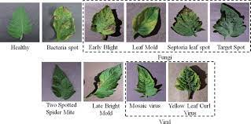

## **Tomato Leaf Disease Image Classification**


<p>Welcome to the Tomato Leaf Disease Image Classification Project README! In this project, I will be training a machine learning model to differentiate between images of tomato leaf diseases. The goal of this project is to develop a robust image classification system that can accurately distinguish between these diseases which will aid in early detection of tomato leaf diseases.</p>

#### **Authors**:[Eugene Kuloba](https://github.com/eugenekuloba)


Table of Contents
========

 * [Project Overview](#Project-Overview)
 * [Objectives] (#Objectives)
 * [Data Sources](#Data-Sources)
 * [Getting Started](#Getting-Started)
 * [Data Preprocessing](#Data-Preprocessing)
 * [Model Selection](#Model-Selection)
 * [Model Training](#Model-Training)
 * [Model Evaluation](#Model-Evaluation)
 * [Inference](#Inference)
 * [Conclusion](#Conclusion)
 * [Future Work](#Future-Work)
 * [For More Information](#For-More-Information)
 * [Repository Structure](#Repository-Structure)


## Project Overview
***

The Tomato Leaf Disease Detection project aims to address the pressing issue of tomato crop health. Tomato plants are susceptible to various diseases that can significantly reduce crop yields if not detected and treated early. This project leverages machine learning techniques to automatically identify and classify common tomato leaf diseases, enabling early intervention and improved agricultural practices.

## Objectives
***

1. Develop a machine learning model capable of accurately identifying multiple tomato leaf diseases.
2. Create a user-friendly interface for farmers to upload images of affected tomato leaves and receive disease diagnosis.
3. Aid in the early detection and treatment of tomato leaf diseases, ultimately improving crop yield and quality.


## Data Sources
***
Data was retrieved from the Data Repository for the [`University of Minnesota`], (https://doi.org/10.13020/D6T11K), under a creative commons license, from a study titled: Camera Trap Images used in "Identifying Animal Species in Camera Trap Images using Deep Learning and Citizen Science". All images were downloaded from Zooniverse and have been resized to 330x330 pixels.

## Getting Started
***

To begin working with this project, follow these steps:

1. Clone this repository: 
```bash
git clone https://github.com/eugenekuloba/tomato-leaf-disease-image-classification
```
2. Navigate to the project directory:
```bash
cd tomato-leaf-disease-image-classification
```
3. Set up your Python environment and install dependencies:
```bash
pip install -r requirements.txt
```
4. Download the dataset and place it in the appropriate directory (data/) following the provided structure.

## Data Preprocessing
***

## Model Selection
***

## Model Training
***

## Model Evaluation
***

## Inference
***

## Conclusion
***

## Future Work
***

## Contributing
***

I welcome contributions to this project! If you find any issues or have ideas for improvements, please submit a pull request or open an issue in the repository.

## Repository Structure 
***

```
├── 
├── 
├── 
├── 
├── 
└── 
```
